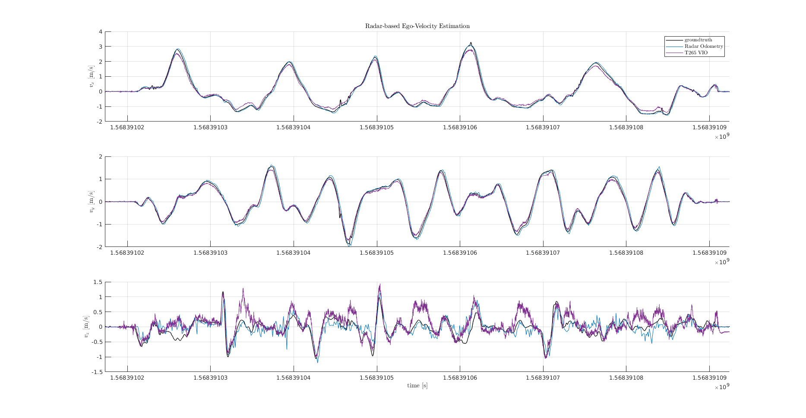

# goggles
*A radar-based 3D linear velocity estimation ROS package*

The figure below compares the Goggles _radar-only_ odometry method to a newly commercially available [Intel T265 Tracking Camera](https://www.intelrealsense.com/tracking-camera-t265/) visual-inertial odometry system. The Goggles radar-only method in comparable and in some cases _outperforms_ the T265.

Goggles estimates the 2D or 3D body-frame linear velocity vector of a sensor platfrom given input data from a single
[TI mmWave Series](http://www.ti.com/sensors/mmwave/overview.html) radar (`/mmWaveDataHdl/RScan` topic). The velocity
estimation scheme takes the following approach:

1. Near-field targets are removed from the target list. Many of these targets are artifacts of antenna interference at
the senor origin, and are not representative of real targets in the scene. These near-field targets also exist in the
zero-Doppler bin and thus would currupt the quality of the velocity estimate.

2. A Maximum Likelihood Sample and Concesus (MLESAC) outlier rejection method is used to filter targets that can be
attributed to noise or dynamic targets in the environment. MLESAC generates an inlier set of targets and a first-pass
linear velocity estimate derived from the inlier set.

3. An Orthogonal Distance Regression ([ODR](http://scholar.colorado.edu/cgi/viewcontent.cgi?article=1311&context=csci_techreports))
algortihm is seeded with the MLESAC linear velocity estimate and generates a final estimate of the body-frame linear
velocity components. Orthogonal Distance Regression _"is the name given to the computational problem associated with finding the maximum likelihood estimators of parameters in measurement error models in the case of normally distributed errors."_
